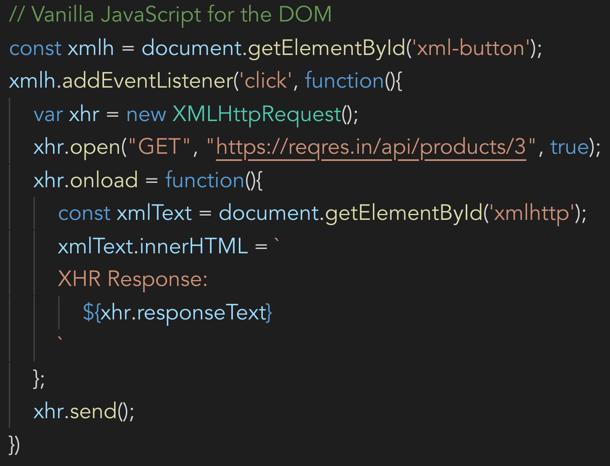
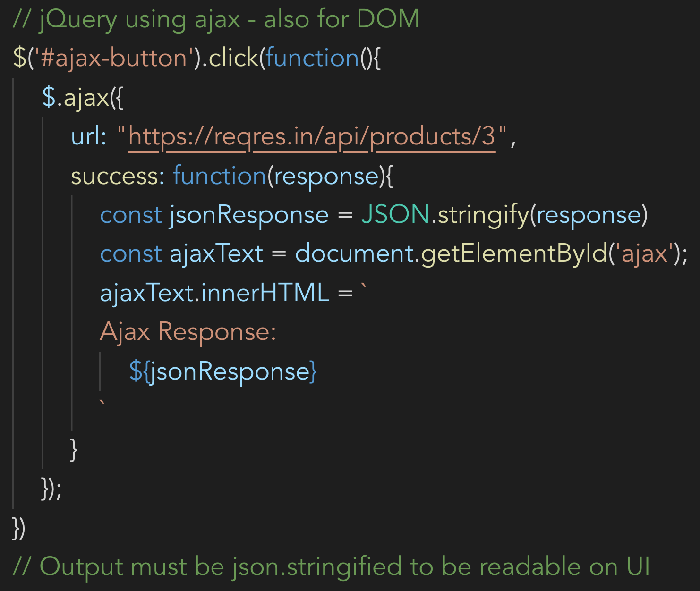
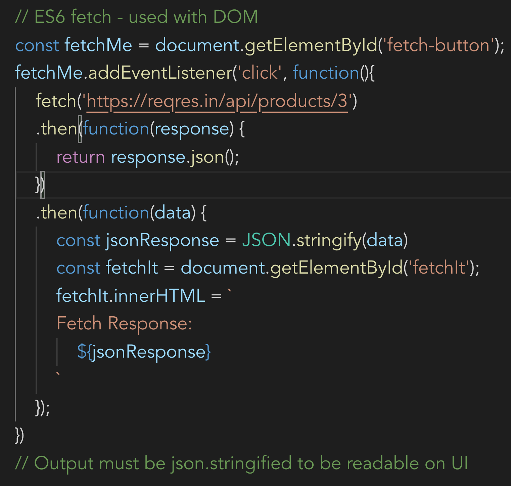
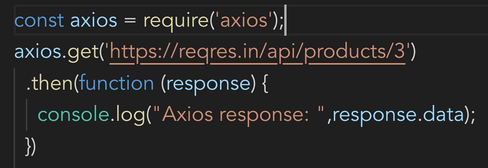
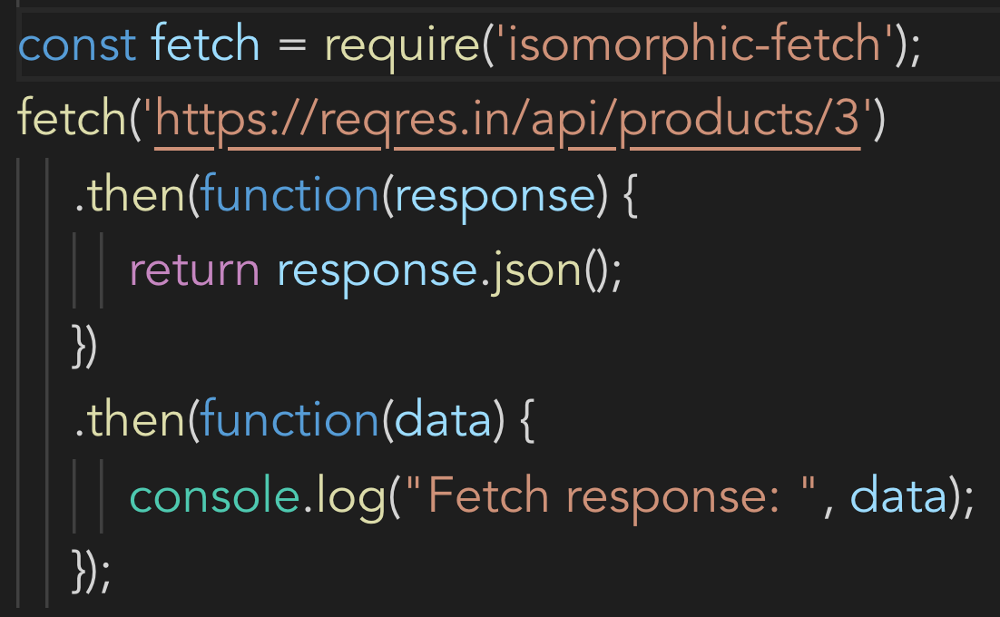

# All Requests

## An academic exercise in various ways to make API requests using JavaScript

### XMLHttp

### Ajax using jQuery

### Fetch on the DOM

### Axios

[Axios on NPM](https://www.npmjs.com/package/axios)

### Isomorphic Fetch

[Isomorphic Fetch](https://www.npmjs.com/package/isomorphic-fetch)

